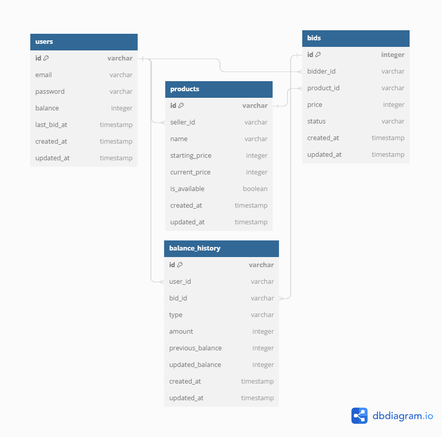
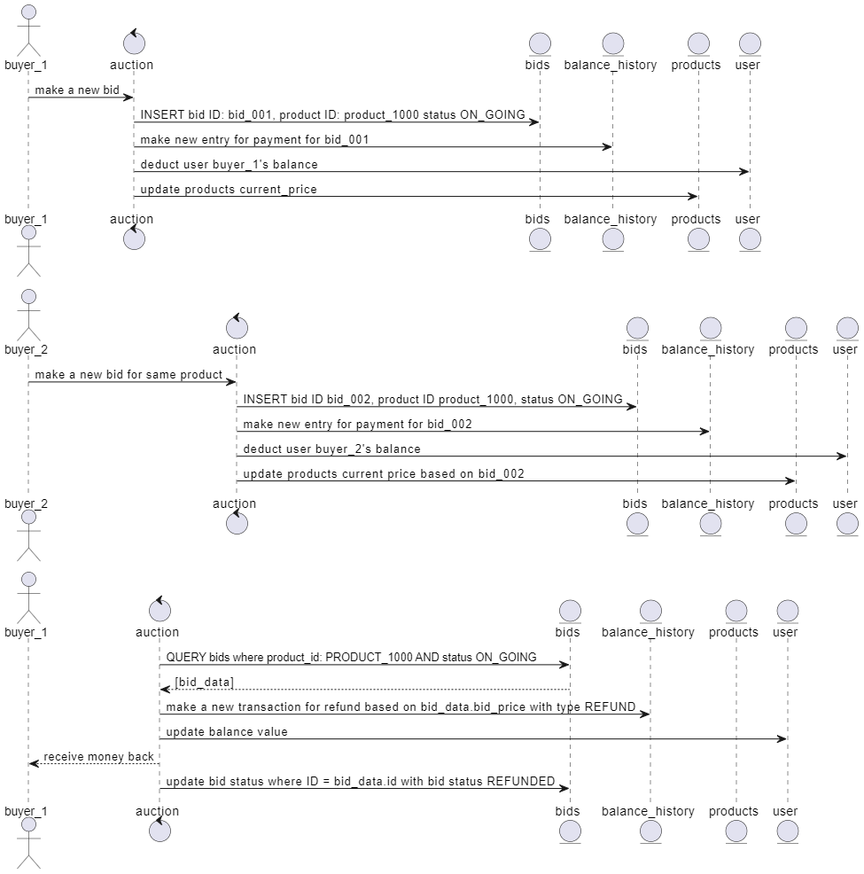
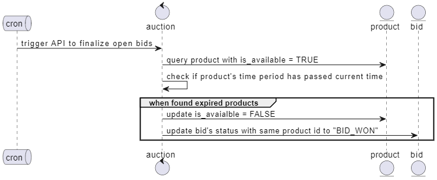

# Mini Auction #
## demonstration on Clean Architecture for Typescript and React with Typescript ##

**Tech Stack**
- Typescript
- Express
- React

**ERD Diagram**

**Sign In/Sign Up/Authorization**
- User sensitive data (password) are encrypted At Rest using Bcrypt
- after `/sign-in` call made, JSON Web token will be generated and will be used for every API calls into backend-service
- API calls are secured with custom-made session middleware

**Auction Flow**
- when a new first-time bid is made, a bid is created with status "ON_GOING"
- balance_history is also created with type "PAYMENT" to indicate a deducted balance from table User.Balance

- When another valid bid is made by another user or same user, the previous bid that are made (by the same user and other user) will be automatically refunded and recorded in balance_history table as "REFUND".
- the previous bids will also get updated to status "REFUNDED"

- balance_history table will always record the bid for any "PAYMENT" OR "REFUND" (except "TOP_UP")

- to illustrate, in Poker, whenever player 1 raise the bet from 100,000 to 150,000, the other players do not necessarily have to add 100,000 + 150,000 to the table, they just have to add another 50,000, so they can continue playing

check diagram below for illustration:

**Finalize Bid Flow**
- every minute, cron job scheduler will be finalizing products that have passed the time period (in hour)
- when products that are still available to bid found, the related bids that are in status "ON_GOING" will be finalized and updated to "BID_WON"
- the product will also be closed by marking the is_available field to false

check diagram below for illustration:

for detailed instructions on how to run the application, please check backend and frontend folder